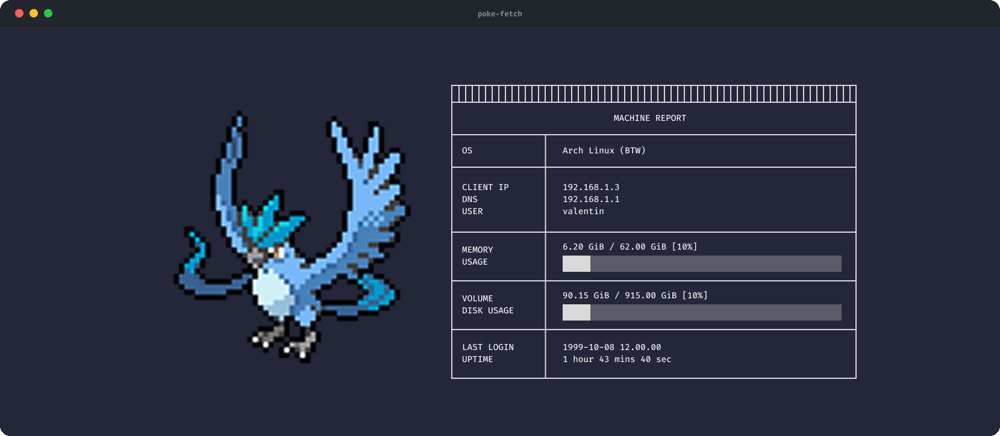

# poke-fetch

>Rediscover the thrill of tall grass, one terminal at a time.


**poke-fetch** is a simple utility that displays a Pokémon as the logo in [fastfetch](https://github.com/fastfetch-cli/fastfetch).

## What it looks like


## Requirements

* [fastfetch](https://github.com/fastfetch-cli/fastfetch)
* A Pokémon fetcher (see below)

By default, **poke-fetch** uses [pokeget-rs](https://github.com/talwat/pokeget-rs).
You need to install it to make the script work out of the box.

If you prefer another tool, you can use any command-line Pokémon getter you like — for example:

* [pokeget-rs](https://github.com/talwat/pokeget-rs) (default, fast and simple)
* [pokemon-colorscripts](https://gitlab.com/phoneybadger/pokemon-colorscripts)
* [krabby](https://github.com/joshiemoore/krabby)


## Installation

Clone the repository and run the installer:

```bash
git clone https://github.com/valentinChantelot/poke-fetch.git
cd poke-fetch
./install.sh
```

This installs the script to `~/.local/bin/poke-fetch`. Run `poke-fetch` to verify the installation.


## Usage

Run the script:

```bash
poke-fetch
```

To use a custom Pokémon command instead of the default, either to use another pokemon getter, display a specific pokemon, or whatever you chose as config for your pokemon getter:

```bash
poke-fetch --poke "pokeget kanto"
poke-fetch --poke "pokeget pikachu"
poke-fetch --poke "pokemon-colorscripts -r"
poke-fetch --poke "krabby random"
```

If the Pokémon command isn't installed or fails, **poke-fetch** falls back to running fastfetch alone. Your system info will still display.

Your **fastfetch** configuration (modules, layout, system info, etc.) remains fully customizable in:

```
~/.config/fastfetch/config.jsonc
```

For configuration details, see the [fastfetch documentation](https://github.com/fastfetch-cli/fastfetch#configuration).


## Auto-run on terminal launch

If you want **poke-fetch** to run every time you open a terminal, add the following line at the end of your shell config (`~/.bashrc` or `~/.zshrc`):

```bash
poke-fetch
```

Then reload your shell:

```bash
source ~/.bashrc   # or ~/.zshrc
```


## Troubleshooting

If running `poke-fetch` gives a “command not found” error, add the following line to your shell config (`~/.bashrc` or `~/.zshrc`):

```bash
export PATH=”$HOME/.local/bin:$PATH”
```

Then reload your shell:

```bash
source ~/.bashrc   # or ~/.zshrc
```


## Uninstallation

From the project directory:

```bash
./uninstall.sh
```

This removes `~/.local/bin/poke-fetch`.


## Related projects

If you want something fancier or feature-rich, check out [pokefetch](https://github.com/Discomanfulanito/pokefetch).


## License

poke-fetch is distributed under the [Unlicense](https://unlicense.org/), placing the code in the public domain.
Use it, modify it, share it — no restrictions.
